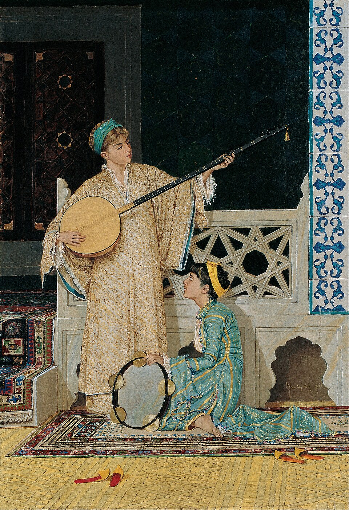

# ykhan.org — Design & Requirements

## Overview

Personal website for Yousuf Khan, hosted on Cloudflare Pages, auto-deployed from GitHub (`ykhan71/ykhan-website`, `main` branch). Static HTML/CSS/JS — no frameworks, no build step.

---

## Site Structure

| Page | File | Status |
|---|---|---|
| Landing | `index.html` | Live |
| Poetry | `poetry.html` | Live |
| Music | `music.html` | Live |
| Stocks | `stocks.html` | Live |

---

## Design System

- **Fonts:** Noto Serif (body), Noto Nastaliq Urdu (Urdu text via `var(--font-urdu)`), sans-serif system stack
- **Colors:** CSS custom properties — `var(--ink)`, `var(--ink-light)`, `var(--ink-faint)`, `var(--accent)`, `var(--bg-soft)`, `var(--line)`
- **RTL text:** `font-family: var(--font-urdu); direction: rtl; text-align: right`
- **Grid:** `repeat(auto-fill, minmax(185px, 1fr))` for poet cards
- **Responsive breakpoint:** 700px (two-column collapses to single)

---

## Poetry Page (`poetry.html`)

### Layout

On load, only the **Favourite Poets** section is visible. The personal poems section is hidden (`display:none`).

### Favourite Poets Section

Seven poet cards in a CSS grid. Cards are interactive buttons that reveal a feature panel below the grid. Clicking an active card toggles it off.

#### Card Rules
- Active cards get `border-color: var(--ink); background: var(--bg-soft)`
- The **"New" badge** marks the most recently updated card. It must move every time a poet's poem is added or changed — only one card carries it at a time. Current: **Ahmed Faraz**
- Badge HTML: `<span style="position:absolute; top:10px; left:10px; font-size:0.6rem; font-family:var(--font-sans); letter-spacing:0.1em; text-transform:uppercase; background:var(--accent); color:#fff; padding:2px 7px; border-radius:20px;">New</span>` — requires `style="position:relative;"` on the parent `<button>`
- To move the badge: remove the `<span>` from the old card and add it (with `position:relative` on the button) to the new card
- **Jaun Elia** is greyed out (`opacity: 0.38`, non-clickable `<div>`) — no poem content yet
- All other poets have content and are fully active

#### Poet Roster

| Poet | Urdu | Years | Featured Poem | Type | Status |
|---|---|---|---|---|---|
| Faiz Ahmed Faiz | فیض احمد فیض | 1911–1984 | گلوں میں رنگ بھرے | غزل | Active |
| Mirza Ghalib | مرزا غالب | 1797–1869 | ہزاروں خواہشیں ایسی | غزل | Active |
| Mir Taqi Mir | میر تقی میر | 1723–1810 | کیا بود و باش پوچھو ہو | قطعہ | Active |
| Ahmed Faraz | احمد فراز | 1931–2008 | سنا ہے لوگ اسے آنکھ بھر کے دیکھتے ہیں | غزل | Active |
| Sheikh Ibrahim Zauq | ذوق | 1790–1854 | لائی حیات آئے | غزل | Active |
| Jaun Elia | جون ایلیا | 1931–2002 | — | — | Greyed out |
| Muztar Khairabadi | مضطر خیرآبادی | 1865–1927 | بحرِ طویل | مسلسل غزل | Active |
| Mohsin Naqvi | محسن نقوی | 1947–1996 | ہم یوسفِ زماں تھے | غزل | Active · **New** |

#### Feature Panel — Standard Layout (all poets except Muztar)

Two-column panel:
- **Left column** (`.poet-feature-meta`): Urdu name, English name, years, intro paragraph, Rekhta link (if available)
- **Right column** (`.poet-feature-poem`): poem type label, then poem title as a clickable `<details>/<summary>` — click the title to expand the full poem below it
- If no poem yet (placeholder `<!-- -->`): shows "Featured poem coming soon." (title non-interactive)

#### Urdu Font & Colour Standards (apply consistently everywhere)

- **Font:** always `font-family: var(--font-urdu)` for all Urdu text — poem body, titles, card names, panel headers
- **Poem body text:** `font-size: 0.96rem; line-height: 2.4; color: var(--ink)` — no `-light` or `-faint` variants
- **Poem titles:** `font-family: var(--font-urdu); font-size: 1.5rem; color: var(--ink); font-weight: 400; line-height: 1.5`
- **Do not use `var(--ink-light)` or `var(--ink-faint)` for any poem text** — this includes body text, verse labels (پہلا مصرع etc.), section headings, and summary elements. All readable poetry-related text uses `var(--ink)`
- `var(--ink-faint)` is reserved for purely decorative or metadata elements (e.g. the small مصرع counter number)
- The Muztar verse style (0.96rem, 2.4 line-height, `var(--ink)`) is the reference standard for all poem rendering

#### Feature Panel — Muztar (special full-width layout)

Triggered when the POETS data entry has a `verses` array instead of a `poem` string. Renders three layers:

1. **Poet header** — name in Urdu (large), years, English name, bio
2. **Behr-e-Taweel note** — explains the metrical form (Fa'ilatun / فعلاتن), clarifies that Behr-e-Taweel is a *metrical form* within the ghazal structure, not a standalone genre
3. **8 collapsible verses** — `<details>/<summary>` accordions, each showing the verse label (پہلا مصرع through آٹھواں مصرع) and expanding to the full unbroken text

No Rekhta link for Muztar (poem not on Rekhta; source is a Medium article).

---

## Muztar Khairabadi — Behr-e-Taweel

**Classification:** Musalsal ghazal. Behr (بحر) means "meter" — Behr-e-Taweel is a metrical form, not a genre. The traditional genres (asnaf) are ghazal, qasida, masnavi, nazm, etc.

**Meter:** Fa'ilatun (فعلاتن) — short-short-long-long — repeated ~100 times per misra.

**Structure:** 8 verses, each a single unbroken line of nearly 100 metrical feet.

**Source:** Medium article by @kamathuday (Hindi/Devanagari transliterations used to verify Urdu text).

---

---

## Markets Page (`stocks.html`)

### Purpose
Personal watchlist with thesis notes. Explicit disclaimer: "This is not financial advice."

### Layout

1. **Live ticker tape** — TradingView ticker tape widget (top of page, all 5 symbols, light theme, transparent)
2. **Disclaimer** — muted left-bordered box: "Nothing on this page constitutes financial advice."
3. **Period + mode controls** — period tabs (1D / 1W / 1M / 3M / 6M / YTD / 1Y) and display mode toggle ($ / %)
4. **Watchlist table** — three columns: Ticker | Thesis | Price / Change
5. **Market notes** — live news feed below the watchlist, pulled from `/api/news`

### Watchlist — 5 Stocks

| Ticker | Name | Conviction | Thesis headline |
|---|---|---|---|
| AMD | Adv. Micro Devices | 4/5 | The GPU challenger |
| NVDA | NVIDIA Corp. | 5/5 | AI infrastructure, watching closely |
| AVGO | Broadcom Inc. | 4/5 | Custom silicon + software flywheel |
| LRCX | Lam Research | 3/5 | Semiconductor equipment leverage |
| SKHY | SK hynix Inc. | 4/5 | HBM memory leader, MU comp |

**Conviction** is shown as filled dots (accent colour) out of 5.

**NVDA language constraint:** Thesis copy must remain neutral/watching — never favoring NVDA. Yousuf works at AMD.

### Price Data

- Fetched from `/api/stock/{ticker}` (Cloudflare Worker)
- Displays: current price, delta pill (green/red), extended hours (pre-market or after-hours) when market is closed
- Delta recalculates on period or mode change without re-fetching

### Chart Modal

- Clicking any ticker opens a TradingView full chart modal (920px wide, 520px tall)
- TradingView `tv.js` loaded lazily on first open
- Symbol map: `NASDAQ:AMD`, `NASDAQ:NVDA`, `NASDAQ:AVGO`, `NASDAQ:LRCX`, `NASDAQ:SKHY`
- Close on Escape key or clicking outside the modal

### Market Notes / News Feed

- Fetched from `/api/news` (Cloudflare Worker)
- Rendered as dated entries with ticker tag, headline (linked), and source name
- Falls back to "News unavailable — check back later." on error

### Responsive

At ≤640px: price column hidden, note entries collapse to single column.

---

## Osman Hamdi Bey — Art Feature

Paintings by Ottoman artist Osman Hamdi Bey (1842–1910) appear on all four pages. Images are stored locally in `images/art/`.

| Page | File | Painting | Year |
|---|---|---|---|
| `index.html` | `tortoise-trainer.jpg` | The Tortoise Trainer | 1906 |
| `poetry.html` | `scholar.jpg` | Scholar | 1878 |
| `music.html` | `musician-girls.jpg` | Two Musician Girls | 1880 |
| `stocks.html` | `carpet-dealer.jpg` | The Carpet Dealer | 1888 |

### Layout Pattern — Art Panel (poetry, stocks)

Full-width image above the main section content, with caption and intro text in a two-column row beneath it:

```html
<div style="margin-bottom:64px; padding-bottom:56px; border-bottom:1px solid var(--line);">
  
  <div style="display:grid; grid-template-columns:1fr 1fr; gap:32px; margin-top:16px; align-items:start;">
    <p style="font-size:0.67rem; color:var(--ink-faint); line-height:1.5; margin:0;">
      <em>TITLE</em>, YEAR &nbsp;·&nbsp;
      <a href="https://en.wikipedia.org/wiki/Osman_Hamdi_Bey" target="_blank" rel="noopener" style="color:var(--ink-faint); text-decoration:none; border-bottom:1px solid var(--line);">Osman Hamdi Bey</a>
    </p>
    <p style="font-family:var(--font-serif); font-size:1rem; font-weight:300; line-height:1.7; color:var(--ink); margin:0; text-align:right;">INTRO TEXT — connects the painting to the page's theme.</p>
  </div>
</div>
```

### Layout Pattern — Art Panel (music — portrait painting)

Music page uses the same full-width stacked layout but **without** `max-height`/`object-fit` cropping, since *Two Musician Girls* is portrait orientation. Instead the image is capped by width and centered:

```html
<div style="margin-bottom:64px; padding-bottom:56px; border-bottom:1px solid var(--line);">
  
  <div style="display:grid; grid-template-columns:1fr 1fr; gap:32px; margin-top:16px; align-items:start;">
    <p style="font-size:0.67rem; color:var(--ink-faint); line-height:1.5; margin:0;">
      <em>Two Musician Girls</em>, 1880 &nbsp;·&nbsp;
      <a href="https://en.wikipedia.org/wiki/Osman_Hamdi_Bey" ...>Osman Hamdi Bey</a>
    </p>
    <p style="font-family:var(--font-serif); font-size:1rem; font-weight:300; line-height:1.7; color:var(--ink); margin:0; text-align:right;">INTRO TEXT</p>
  </div>
</div>
```

### Landing Page (`index.html`) — Hero Layout

Two-column CSS grid (text left, painting right). Painting hides at ≤900px.

```css
.hero { grid-template-columns: 1fr 420px; gap: 64px; }
.hero-painting img { width:100%; max-height:580px; object-fit:cover; border-radius:2px; }
@media (max-width:900px) { .hero { grid-template-columns:1fr; } .hero-painting { display:none; } }
```

Credit caption sits below the painting image: italic title, year, linked artist name, one-line bio.

---

## Music Page (`music.html`)

Two sections of Spotify embeds rendered as a responsive card grid (`repeat(auto-fill, minmax(280px, 1fr))`). Each card has the embed iframe + an italic serif note below it.

### Urdu / South Asian — "Currently on repeat" (7 tracks)

| # | Title | Artist | Spotify Track ID |
|---|---|---|---|
| 1 | Chand Tanha | Meena Kumari | 43qYrY010Hd5QQjkxcoAoz |
| 2 | Aapki Yaad Aati Rahi Raat Bhar | Chhaya Ganguli | 2bCwBISaRkGc0CUY5t7X87 |
| 3 | Ham Tere Pyar Mein | Lata Mangeshkar | 2i59WVQlfjtScPqg3Y8Oor |
| 4 | Voh Baaten Teri Voh Fasane Tere | Tahira Syed | 7nxODFmY7EgsG6PQEjjv0J |
| 5 | Faasle | Kaavish & Quratulain Balouch | 6YNl1rXbhKvmbMrw9cp3RQ |
| 6 | Ae Ishq Hamen | Nayyara Noor | 7kElyPuukh0L4ypppyoRhL |
| 7 | Tum Apna Ranjh o Gham Apni | — | 57U2eQNEWPgMzIUhHVCVDq |

### English (4 tracks)

| # | Title | Artist | Spotify Track ID |
|---|---|---|---|
| 1 | Straight From The Heart | Bryan Adams | 6oqBRt8j0VSYtGdUsceSq7 |
| 2 | Sorry I'm Here For Someone Else | Benson Boone | 15zJeVUmKFnbrxm9dxcxYD |
| 3 | Highway to Hell | AC/DC | 2zYzyRzz6pRmhPzyfMEC8s |
| 4 | Livin' On A Prayer | Bon Jovi | 0J6mQxEZnlRt9ymzFntA6z |

Embed URL format: `https://open.spotify.com/embed/track/TRACK_ID?utm_source=generator`

---

## Pending / Future

- **Jaun Elia** — add a featured sher or ghazal; card will become active and lose grey-out
- **Personal poems** — section exists in HTML but is hidden; to be shown when Yousuf adds his own work
- **Featured sher of the day** — discussed, deferred

---

## Workflow Notes

- All edits go to `C:\Users\Owner\OneDrive\Documents\GitHub\ykhan-website\`
- Push to GitHub triggers Cloudflare Pages auto-deploy (can take a few minutes)
- Hard refresh (Ctrl+Shift+R) or incognito window if browser cache shows stale content
- **"New" badge** — update manually in HTML whenever a poet's content changes; only one card carries it at a time

## Claude's Working Rules

1. **Read `design.md` before making any change** — always load this file first to understand current design decisions, standards, and constraints before touching any code.
2. **Update `design.md` after any change** — after every edit, check whether it represents a design or requirement change and update this file accordingly. This keeps the document the single source of truth.

---

## Constraints

- Yousuf works at AMD. Any references to NVDA on the site must use neutral/watching language — never favoring NVDA.
